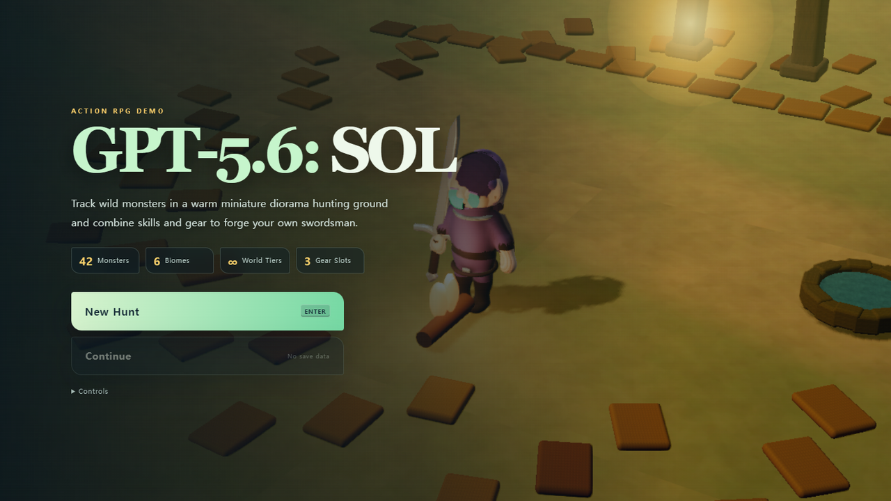
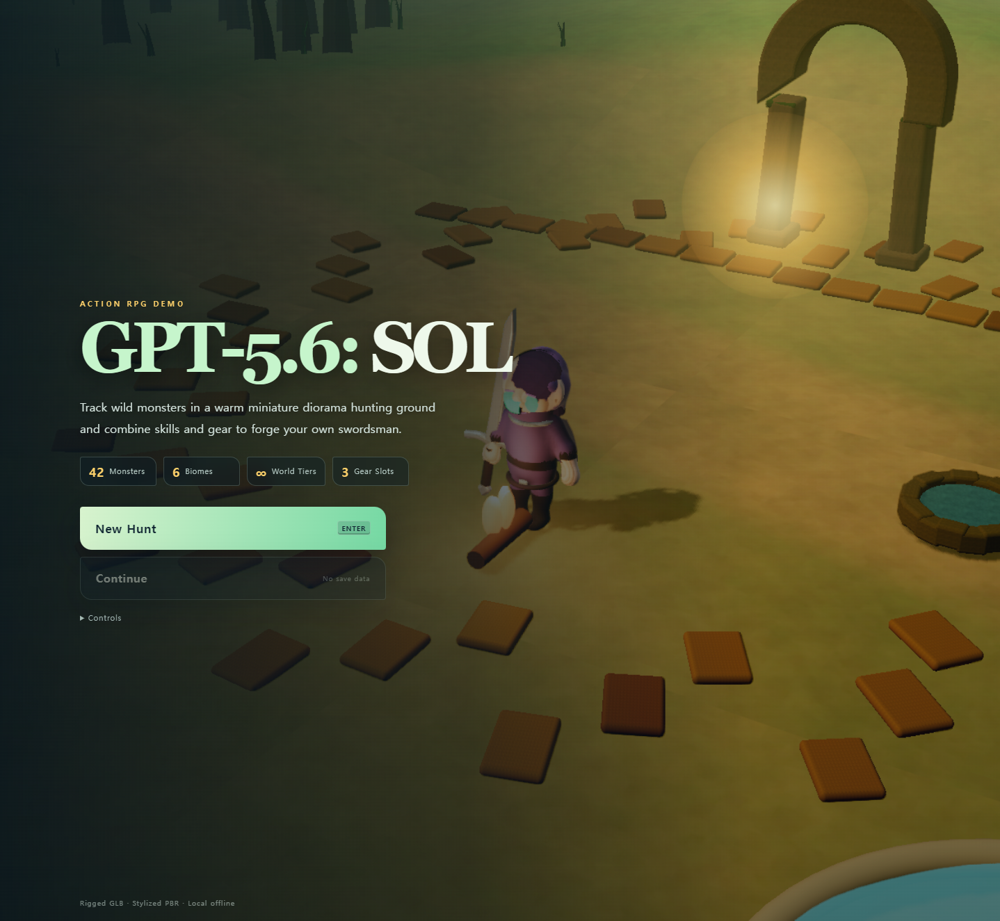
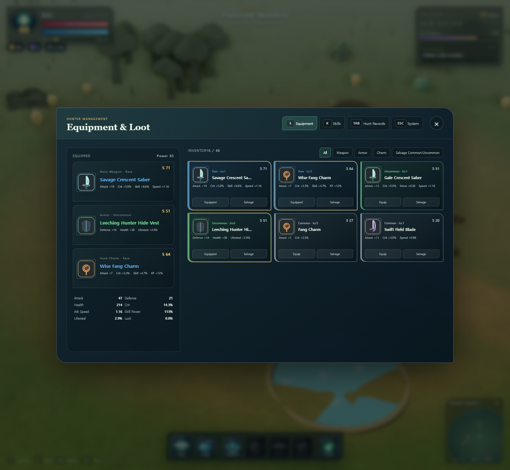
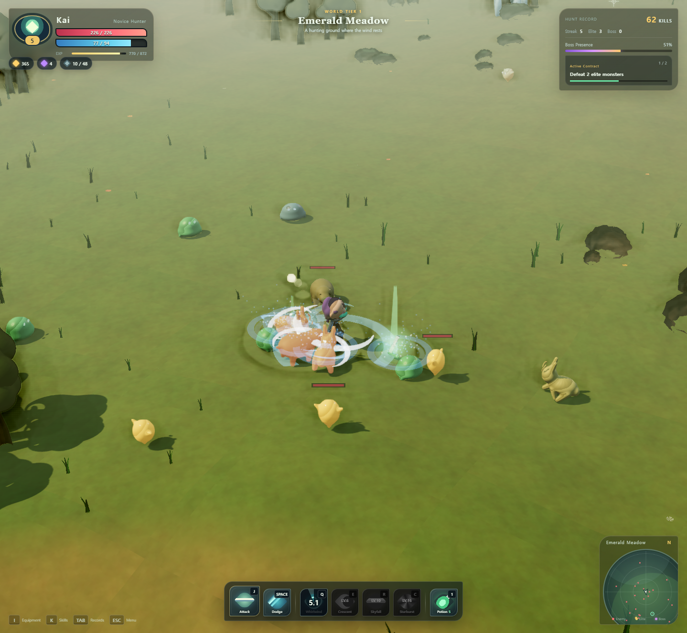

# GPT-5.6: Sol / Action RPG DEMO

**[▶ Play the demo](https://gpt-rpg.dextune.com)** — try it live at [https://gpt-rpg.dextune.com](https://gpt-rpg.dextune.com).

> Crafted via [ChatGPT](https://chatgpt.com) using the **GPT-5.6-SOL** model — an AI-native game built entirely through conversational agent workflows.

A browser-based 3D action RPG — hunt, farm, upgrade, ascend world tiers. Zero CDN, fully local. Built with AI agents; customize everything via agent prompts to fit your taste.

## Screenshots









## Quick Start

```bash
# Option A — Node.js
node server.mjs        # then open http://127.0.0.1:8080

# Option B — Python
python -m http.server 8080 --bind 127.0.0.1
```

Do not open `index.html` directly (ES modules + GLB require a local server). Change port via `PORT=3000 node server.mjs`.

## Tech Stack

| Category | Libraries / Tools |
|----------|------------------|
| **Engine** | [Three.js r160](https://threejs.org) (bundled locally under `vendor/`) |
| **Rendering** | WebGL with stylized PBR, cel-shading, SSAO, Bloom, FXAA, Bokeh DOF |
| **Animation** | GLB skeletal rigs via `SkeletonUtils`, `AnimationMixer` with cross-fade |
| **Lighting** | Warm directional sun + sky hemisphere, contact shadows, per-zone fog |
| **Terrain** | Procedural layered PBR terrain (fbm heightmap, texture blending) |
| **Environment** | Instanced vegetation, biome-specific decorations, water planes |
| **Audio** | WebAudio synthesis — hit/swing/skill/pickup/boss SFX, no sample files |
| **UI** | DOM-based HUD with floating damage text, minimap, skill cooldowns |
| **Save** | `localStorage` auto-save with versioned schema |
| **Server** | Lightweight Node.js (`server.mjs`) or Python `http.server` |

## Architecture

```text
assets/                 GLB models, PBR textures, asset manifest
js/assets/              loading, cache, reference counting, LOD selection
js/characters/          rigged character/monster factories and animation control
js/graphics/            render pipeline, lighting, post-processing, materials, effects
js/world/               terrain, environment, vegetation, water, biome placement
js/entities/            player/enemy gameplay state
js/systems/             combat, spawning, loot, hunt systems
vendor/                 local Three.js r160 and required addons/decoders
tools/assets/           source model/texture/LOD generation tools
tests/integrity.mjs     module, content, save, local dependency validation
```

## Controls

| Action | Key |
|---|---|
| Move | `WASD` or arrow keys |
| 4-hit basic attack | Left mouse click or `J` |
| Invincible dodge | Right mouse click or `Space` |
| Whirlwind spin slash | `Q` · Lv.3 |
| Crescent blade wave | `E` · Lv.6 |
| Skyfall dive | `R` · Lv.10 |
| Starburst | `C` · Lv.16 |
| Healing potion | `1` |
| Equipment / Skills / Hunt log | `I` / `K` / `Tab` |
| System menu | `Esc` |
| Camera rotate / zoom | `Z`, `X`, middle-button drag / wheel |
| Developer stats HUD | `F3` |

Mouse position is the aim point for attacks and skills.

## Graphics quality

Default quality is `high` and can be changed in the system menu. It can also be set via a URL query.

```text
http://127.0.0.1:8080/?quality=high
http://127.0.0.1:8080/?quality=medium
http://127.0.0.1:8080/?quality=low
```

- Local GLB assets and SkeletonUtils-based skeletal cloning
- AnimationMixer · AnimationAction and cross-fade between states
- Distance-based LOD for player and monsters
- Stylized PBR materials with PBR auxiliary textures
- Warm sunlight, sky light, grounded contact shadows
- SSAO, weak Bloom, FXAA, limited DOF at high quality
- Optional character silhouette outline
- Terrain PBR layers and hand-placed environment dressing
- Instanced repeated props and dynamic render resolution
- F3 developer HUD with FPS, draw call, triangle, geometry, texture stats

## Content

- 6 ecological zones
- 42 monster types and 6 zone bosses
- Common · high · rare · hero · legendary equipment
- 8 weapons, 6 armors, 6 charms
- 4 active skills and 4 passive skills
- Elite units, kill streaks, random hunt contracts, boss appearance gauge
- Infinite world tiers, auto-save, continue, hub respawn

## Validation

```bash
node tests/integrity.mjs
```

It checks module paths, content counts, boss mappings, save data, HUD slots, local Three.js, and license files.

## Regenerate assets

The Node.js tools use local `vendor/` modules.

```bash
node tools/assets/generate_assets.mjs
node tools/assets/generate_environment_lods.mjs
python3 tools/assets/generate_textures.py
python3 tools/assets/bake_world_maps.py
```

The Python texture tools require Pillow and NumPy.

## License

This project's own game code, assets, and content are free to download, modify, and distribute.

**Three.js** (r160) is used under the **MIT License** — Copyright © 2010–2023 Three.js Authors. Free to use, modify, and distribute.

For details, see `THIRD_PARTY_NOTICES.md` and `THIRD_PARTY_LICENSES/`.
